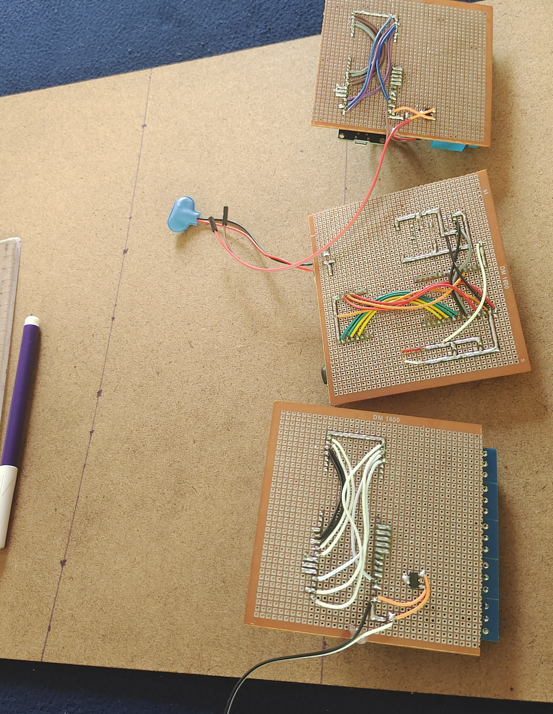

# Web-Controlled Street Light System with Fault Detection and Energy Optimization
The Smart Street Light System transforms traditional street lighting into an
automated, energy-efficient solution. Using LDRs to detect daylight intensity and
fall detection, along with infrared sensors to monitor vehicle movement, the system intelligently manages street lights. It features two separate batches of lights, each with individual sensors, ensuring lights turn on or off based on vehicle presence and ambient light. 

The system also includes fault detection, sending alerts to a central dashboard and linemen to reduce downtime. Additionally, it allows region-specific parametric setups, enabling or disabling sensors based on environmental factors like traffic density or tree cover. This approach not only saves energy but also simplifies maintenance, supporting the development of smart and sustainable urban
infrastructure.
## Photos

### Making Streetlights

### Soldering

### Streetlight

### Gluing

